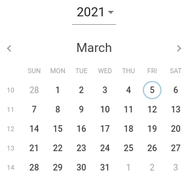
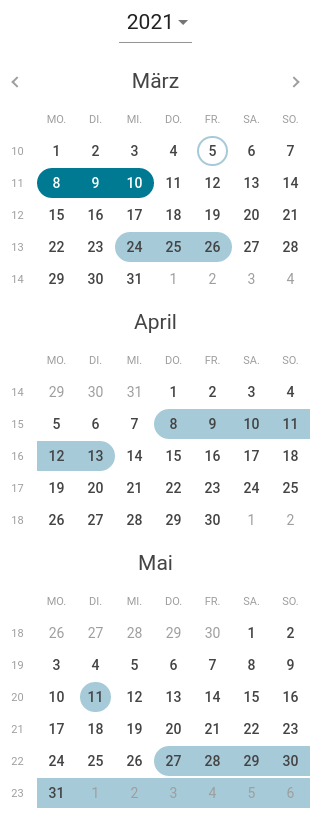

<!-- SPDX-License-Identifier: MIT -->
<!-- Copyright (c) 2021 Daimler TSS GmbH -->
# MultiEventCalendar

You find a lot of different calendars throughout the World Wide Web. But most of them are date pickers/visualizers only, mostly for one or two dates.

If you search for an angular calendar, which can show multiple events your search ends right here.

|This calendar can be date picker|or| it can show multiple events|
|---|---|---|
||->||

___

## Quickstart Guide

This repository contains the [calendar library](./projects/multi-event-calendar) and a [simple demonstration app](./projects/multi-event-calendar-tutorial) as well.  

If you like to see the calendar in action and try its features yourself please use the demonstration app:

1. Clone this repository with a git client of your choice or with command line:
    ```bash
    git clone https://github.com/Daimler/multi-event-calendar.git
    cd multi-event-calendar
    ```

2. Install all dependencies
    ```bash
    npm install
    ```
    > Note: via the .npmrc file in this directory github packages is configured as a npm registry. 
3. Serve the angular application
    ```bash
    ng serve
    ```   
    > Note: For experimenting with the calendar's behavior have a look at the [input and output description](./projects/multi-event-calendar/README.md#inputs).

If you like to use the calendar in your own angular application please [read.me](./projects/multi-event-calendar/README.md) for further details.

---

## Requirements

- NPM installed

## Contributing

We welcome any contributions.  
If you want to contribute to this project, please read the [contributing guide](CONTRIBUTING.md).  
To get started with the development, please read the [developing guide](DEVELOPING.md).

## Code of Conduct

Please read our [Code of Conduct](CODE_OF_CONDUCT.md) as it is our base for interaction.

## License

This project is licensed under the [MIT LICENSE](LICENSE).

## Provider Information

Please visit <https://www.daimler-tss.com/en/imprint/> for information on the provider.

Notice: Before you use the program in productive use, please take all necessary precautions,
e.g. testing and verifying the program with regard to your specific use.
The program was tested solely for our own use cases, which might differ from yours.
